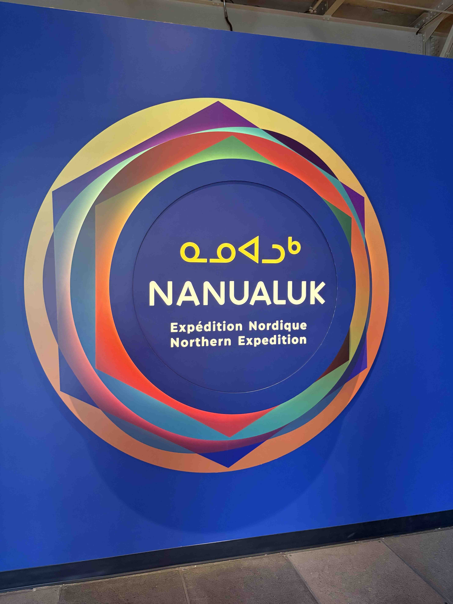

## 1. Informations 

**Nom de l’exposition ou de l’événement :**  
NANULAK Expédition Nordique ou Northern Expedition

**Affiche de l’exposition :**  

> Affichage par Nguyen Phu Thanh

**Lieu de mise en exposition :**  
Centre des sciences de Montréal 
2 De La Commune St W, Montreal Quebec H2Y 4B2 

> Adresse par Nguyen Phu Thanh

**Type d’exposition :**  
Exposition intérieure et permenante

**Date de visite :**  
03/27/2026

---

## 2. Informations sur l’œuvre ou le dispositif

**Titre de l’œuvre ou du dispositif :**  
Une glace fragile

**Vue d’ensemble de l’oeuvre :**  

> L'ensemble de l'oeuvre par Nguyen Phu Thanh

**Nom de l’artiste ou de la firme :**  
Centre des sciences de Montréal et l'équipe de conception de l’exposition 

> 

**Année de réalisation :**  
03/01/2026

---

## 3. Description

---

## 4. Type d’installation

**Type :**
- Interactive
- Muséale
- Immersive
- Multimédia

---

## 5. Fonction du dispositif multimédia

Fonctions principales :

---

## 6. Mise en espace

### Croquis simplifié

> Une schema du mise en espace par Nguyen Phu Thanh
---

## 7. Composantes et techniques

### Parties composantes
- Textes
- Sensors
- Boutons / zone à toucher
- Écran tactiles 
 

> Matériaux

### Éléments nécessaires à la mise en exposition
- Panneaux inclinés
- Modules en bois / métal
- Supports des écrans et visuels
---

## 8. Expérience vécue

> Mise en espace par Nguyen Phu Thanh
---

## 9. Réflexion personnelle

### Ce qui m’a plu

J'aimais bien le fait que le centre des science de Montreal, on assurait que l'exposition est bien securisé et accessible pour les enfants puisqu'ils sont les cibles de choix. 

### Ce que je ferais autrement

---

## 10. Références
 
(https://www.centredessciencesdemontreal.com/exposition-permanente/nanualuk-expedition-nordique)

Photos prises par Nguyen Phu Thanh
