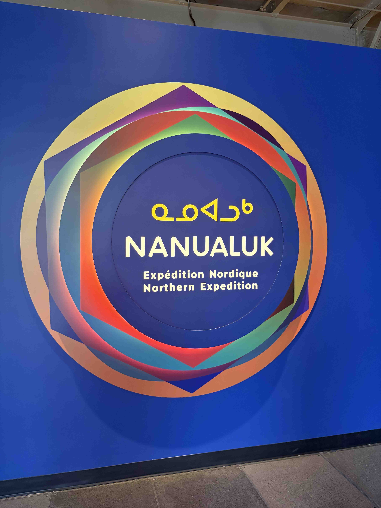
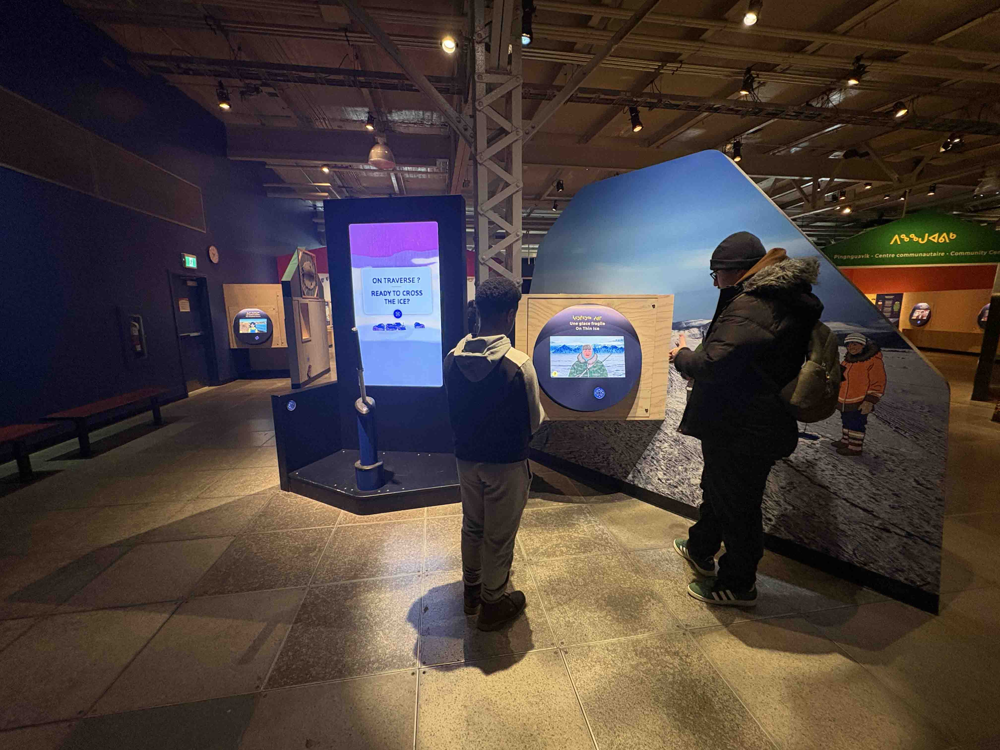
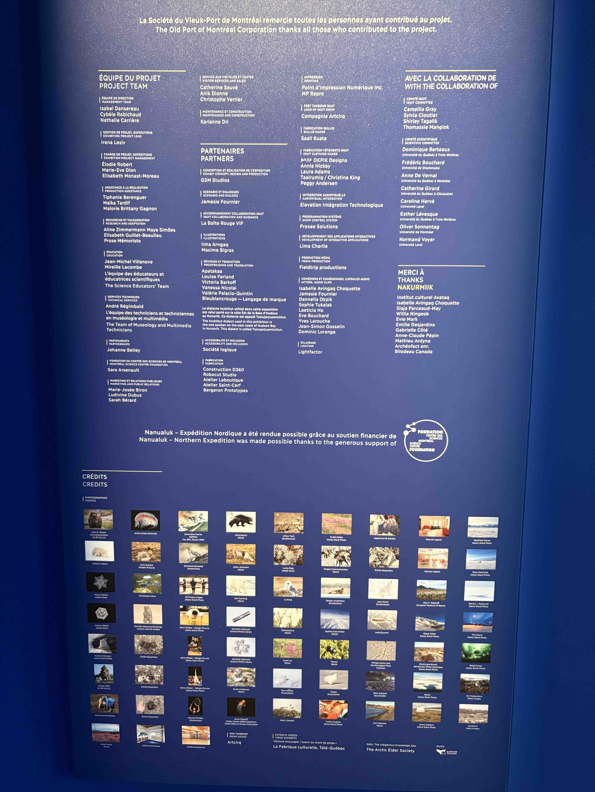
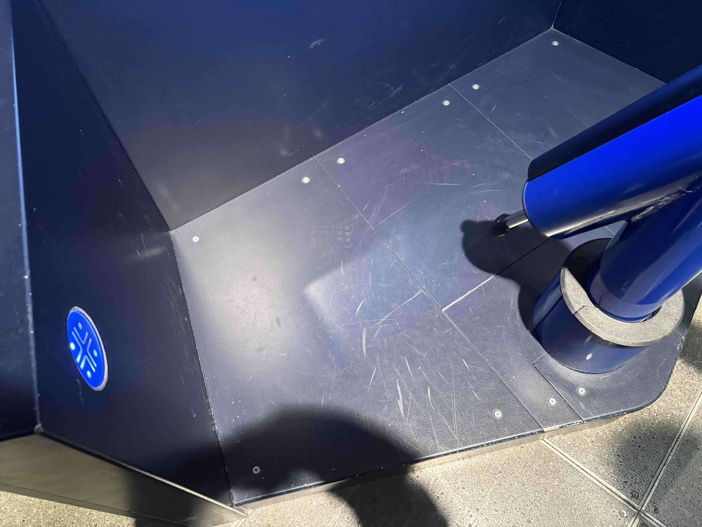
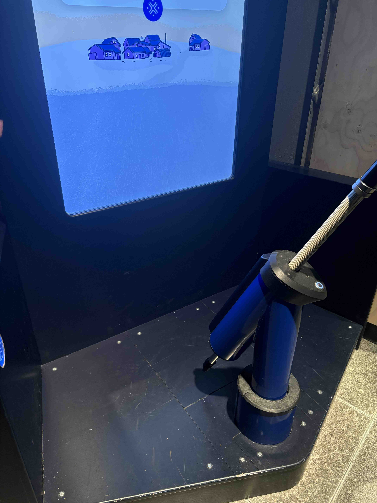
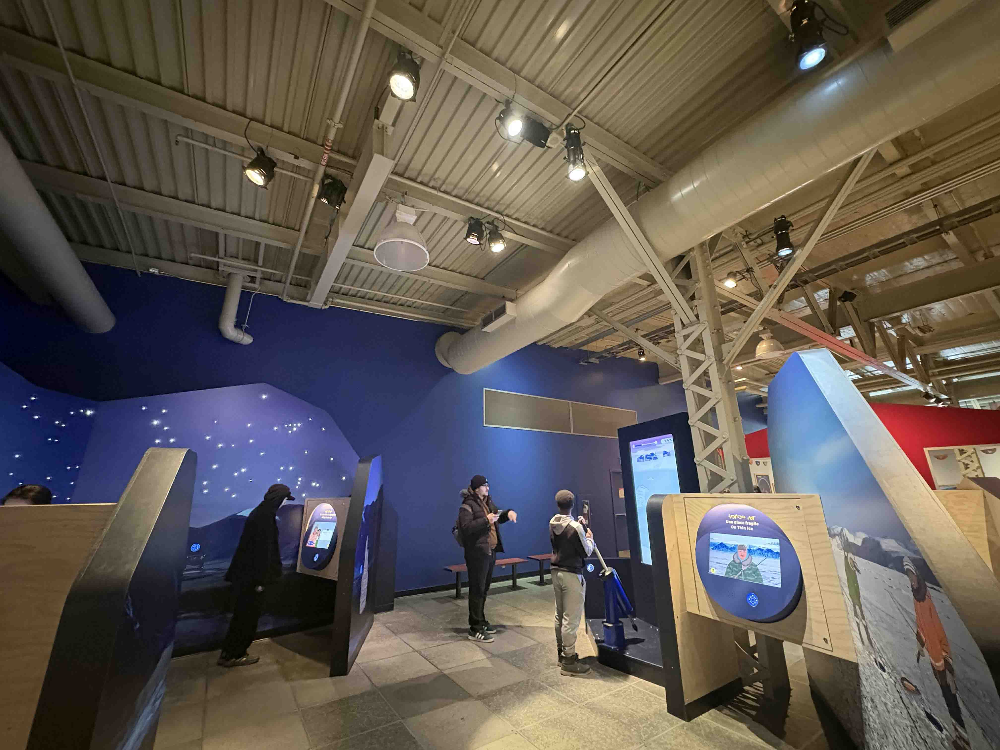
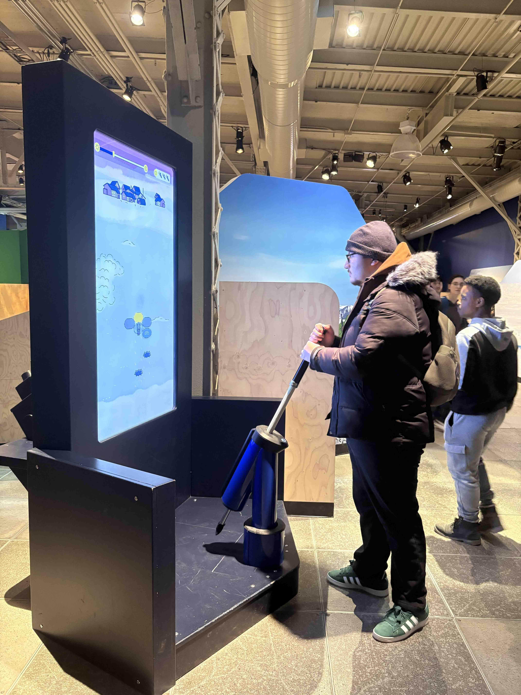

## 1. Informations 

**Nom de l’exposition ou de l’événement :**  
NANULAK Expédition Nordique ou Northern Expedition

**Affiche de l’exposition :**  

> Affichage par Nguyen Phu Thanh

**Lieu de mise en exposition :**  
Centre des sciences de Montréal 
2 De La Commune St W, Montreal Quebec H2Y 4B2 

> Adresse par Nguyen Phu Thanh

**Type d’exposition :**  
Exposition intérieure et permenante

**Date de visite :**  
03/27/2026

---

## 2. Informations sur l’œuvre ou le dispositif

**Titre de l’œuvre ou du dispositif :**  
Une glace fragile

**Vue d’ensemble de l’oeuvre :**  

> L'ensemble de l'oeuvre par Nguyen Phu Thanh

**Nom de l’artiste ou de la firme :**  
Centre des sciences de Montréal et l'équipe de conception de l’exposition 

> 

**Année de réalisation :**  
03/01/2026

---

## 3. Description

Nanualuk – Expédition Nordique est une expérience immersive qui guide les visiteurs vers une compréhension scientifique et éducative à travers des jeux interactifs. Elle leur permet de s’amuser tout en découvrant la vie quotidienne des peuples autochtones. Par exemple, Glace fragile est un jeu interactif dans lequel les visiteurs doivent rejoindre leur village avant le coucher du soleil. À l’aide d’un harpon, ils vérifient la solidité de la glace qui sert de passage afin de pouvoir la traverser en toute sécurité.

---

## 4. Type d’installation

**Type :**
- Interactive
- Immersive
- Multimédia

Le type d’installation présenté est une installation interactive multimédia immersive. Lorsque l’on en fait l’expérience, on remarque la présence d’écrans thématiques liés à Nanualuk, ainsi qu’une atmosphère et des sons nordiques qui contribuent à plonger le visiteur dans l’univers d’une expédition nordique.

---

## 5. Fonction du dispositif multimédia

Fonctions principales :
La fonction de l’installation est d’offrir aux visiteurs une expérience à la fois interactive et éducative. Elle leur permet d’apprendre de manière agréable et engageante. Les écrans, l’atmosphère, la lumière et le son contribuent à plonger les visiteurs dans une expérience immersive.

---

## 6. Mise en espace

La mise en espace de cette installation est semi-circulaire, ce qui permet aux visiteurs d’observer la personne qui manipule le dispositif et d’attirer ainsi leur intérêt. Les lumières sont orientées vers les écrans afin d’améliorer la visibilité. Deux écrans sont installés : l’un diffuse les instructions et explique le jeu, tandis que l’autre affiche l’interface destinée aux joueurs.

### Croquis simplifié

> Une schema du mise en espace par Nguyen Phu Thanh
---

## 7. Composantes et techniques

### Parties composantes
- Textes
- Sensors
- Boutons / zone à toucher
- Écran tactiles 
 

> Matériaux

### Éléments nécessaires à la mise en exposition
- Panneaux inclinés
- Modules en bois / métal
- Supports des écrans et visuels

---

## 8. Expérience vécue

> Mise en espace par Nguyen Phu Thanh
---

## 9. Réflexion personnelle

### Ce qui m’a plu

Ce qui m’a plu dans cette installation est avant tout son aspect interactif et immersif, qui rend l’expérience plus engageante qu’une exposition traditionnelle. La mise en espace ouverte permet une circulation fluide et donne une impression de liberté dans la découverte.
 

### Ce que je ferais autrement

Je modifierais certains éléments afin d’améliorer l’expérience globale de l’installation. D’abord, j’ajouterais une circulation plus guidée, par exemple avec un parcours suggéré ou une signalisation au sol, afin d’aider les visiteurs à mieux comprendre l’ordre de découverte du contenu.

## 10. Références
 
(https://www.centredessciencesdemontreal.com/exposition-permanente/nanualuk-expedition-nordique)

Photos prises par Nguyen Phu Thanh
