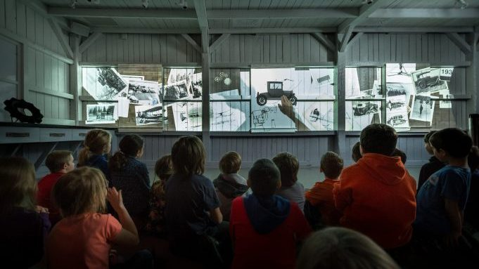

# La création d’un projet multimédia

## Introduction

Un des rôles d’un technicien en multimédia est d’assurer et de maintenir des appareils technologiques. Cependant, ces techniciens ont bien plus de tâches à effectuer. C’est pour cette raison qu’un technicien du Musée de l’ingéniosité présente le concept de la réalisation multimédia dans un musée, réalisé par plusieurs techniciens comme lui. Il explique le contexte de réalisation, la mise en exposition et le fonctionnement des dispositifs créés pour les salles de l’exposition permanente.
## Introduction de Martin Boucher

Martin Boucher est un technicien en multimédia du Musée de l’ingéniosité Joseph-Armand-Bombardier. Son rôle dans le musée est d’assurer et de maintenir les appareils technologiques afin de garantir la longévité des équipements. Par exemple, dans ce musée, il doit s’assurer que les mécanismes des appareils fonctionnent jusqu’en 2030.
De plus, en tant que technicien, il doit aussi créer du contenu visuel pour répondre aux besoins de son emploi. Finalement, il joue également le rôle de guide pour les visiteurs qui ont des questions sur les expositions.
## Le contexte de réalisation

Pour réaliser une œuvre multimédia, les techniciens doivent tenir compte de plusieurs facteurs. Ceux-ci sont divisés en différentes catégories : informatique, gestion de projet, éclairage (DMX et optique), audio (MIDI et mixage sonore) et électricité.
Les tâches sont réparties entre plusieurs équipes afin de travailler à la fois efficacement et rapidement. Par exemple, le département informatique s’occupe de la conversion des formats de fichiers, de la programmation et de la communication entre les appareils. La gestion de projet veille à l’organisation des membres et à la collaboration afin de respecter les délais de remise.
L’éclairage, le DMX, l’optique ainsi que l’audio et le mixage sonore déterminent la manière dont la lumière et le son sont utilisés pour attirer l’attention et améliorer la visibilité de l’œuvre. Finalement, l’électricité permet d’alimenter tous les appareils afin d’assurer le bon fonctionnement de l’installation.

## Mise en exposition

Martin Boucher démontre, à l’aide d’un exemple de projet (un garage), comment les objets sont placés stratégiquement et explique ses choix. Pour l’éclairage, il a choisi d’utiliser un projecteur laser plutôt qu’un projecteur à lampe, car l’entretien de ce dernier est plus élevé en raison de son intensité lumineuse.
Dans un projet nécessitant peu de lumière, le projecteur laser est donc plus avantageux puisqu’il demande moins d’entretien. Ainsi, lors de la création d’une exposition, les techniciens doivent planifier les matériaux et justifier leurs choix afin de concevoir une expérience immersive et agréable.

## Fonctionnement des dispositifs

Pour améliorer une exposition, il est important de capter l’intérêt des visiteurs afin d’assurer sa pérennité. Pour attirer leur attention, prenons l’exemple de l’exposition de la STM. Les techniciens ont dû innover pour transformer des projets peu attrayants en expériences engageantes.
Avec ce dispositif, ils ont implanté un système interactif qui émet une mélodie lorsqu’un utilisateur réussit le jeu. Cette méthode permet non seulement de capter l’attention, mais aussi d’enseigner de manière ludique, plutôt que de simplement lire des informations.

## Conclusion
Marthin Boucher explique comment le rôle d’un technicien en multimédia comprend de nombreuses tâches essentielles au succès d’une exposition en milieu muséal. Cette présentation nous a ainsi aidés à mieux comprendre la réflexion et la résolution nécessaires derrière la réalisation d’un projet multimédia. Ce que j’ai bien aimé lors de la présentation, c’est le sentiment de passion que le présentateur dégage, ce qui montre qu’il aime son métier et rend sa présentation plus réaliste et facile à comprendre.

