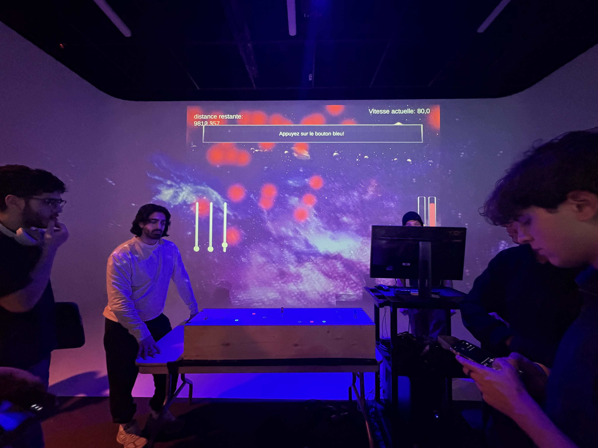
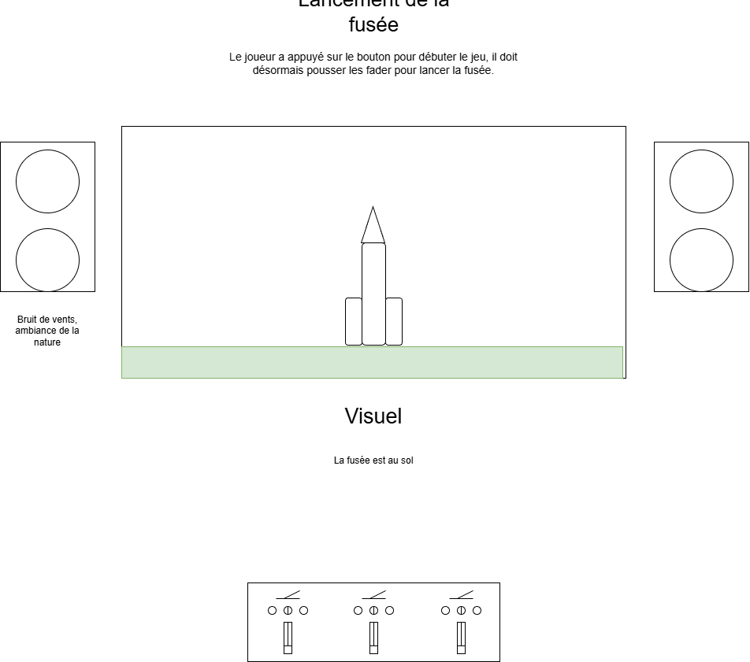
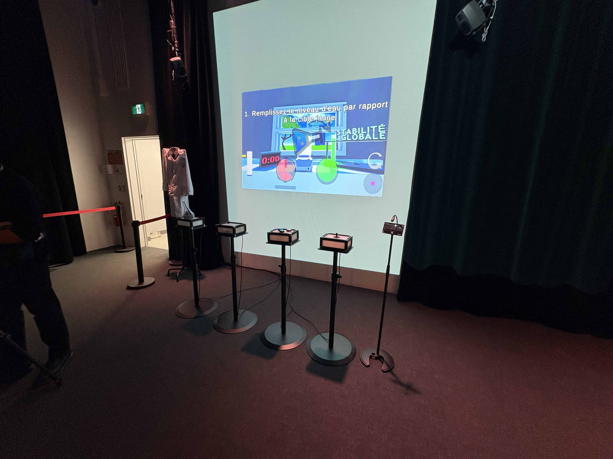
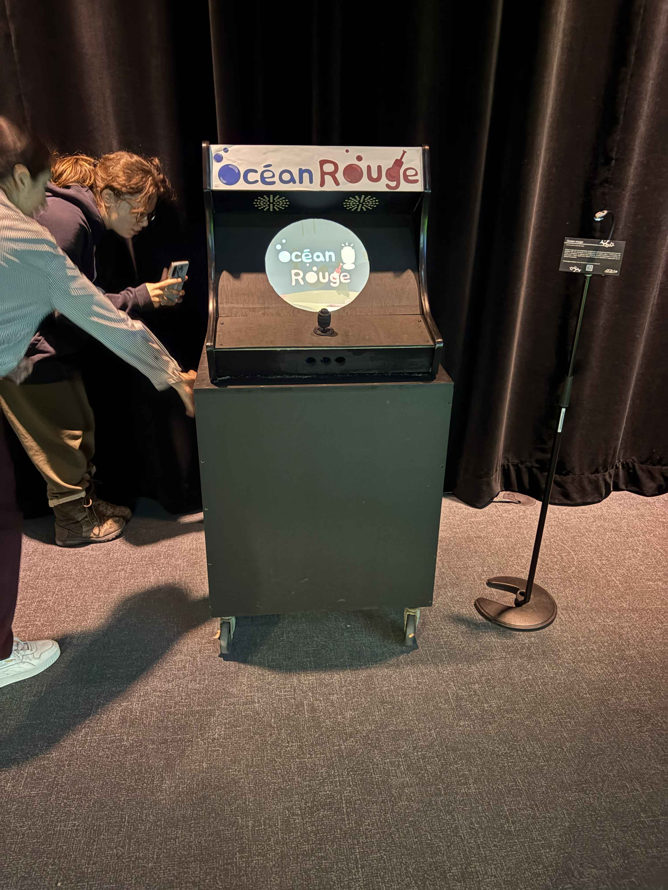
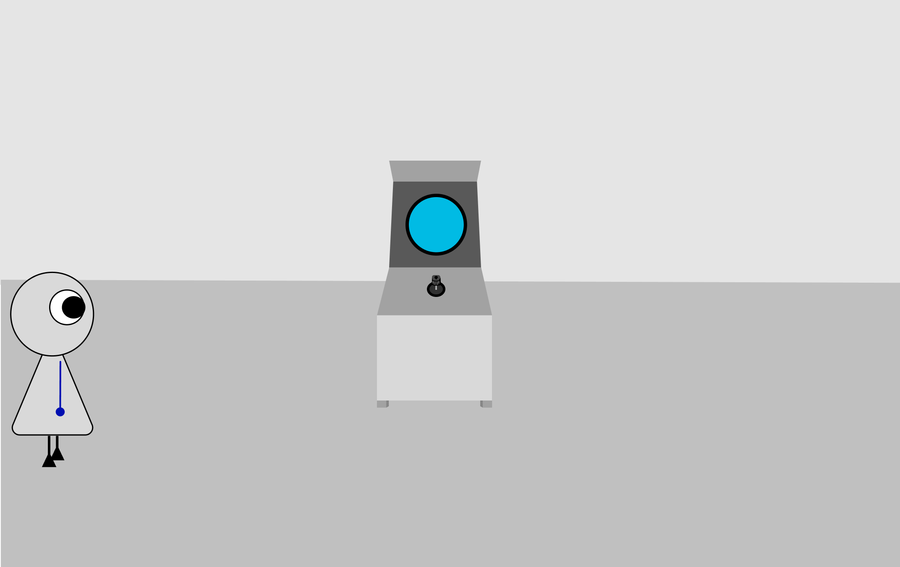
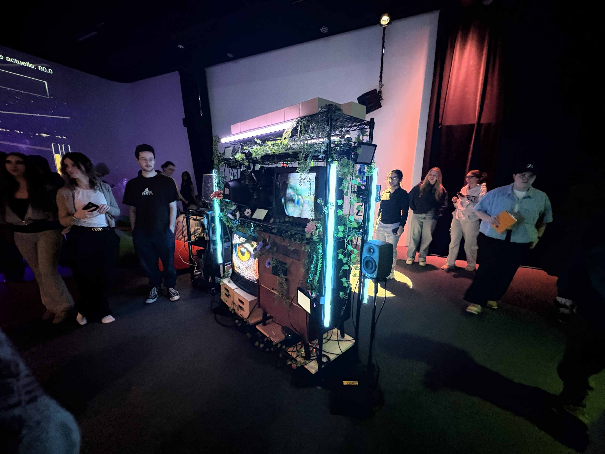
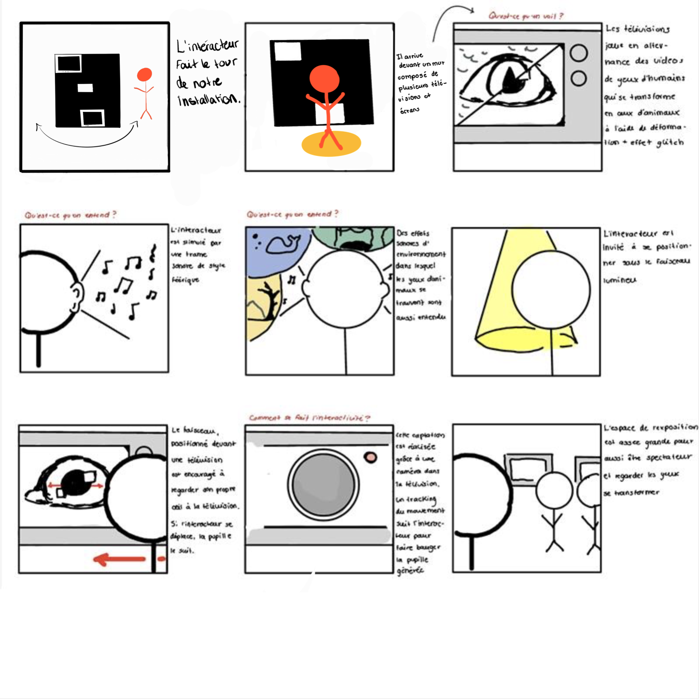
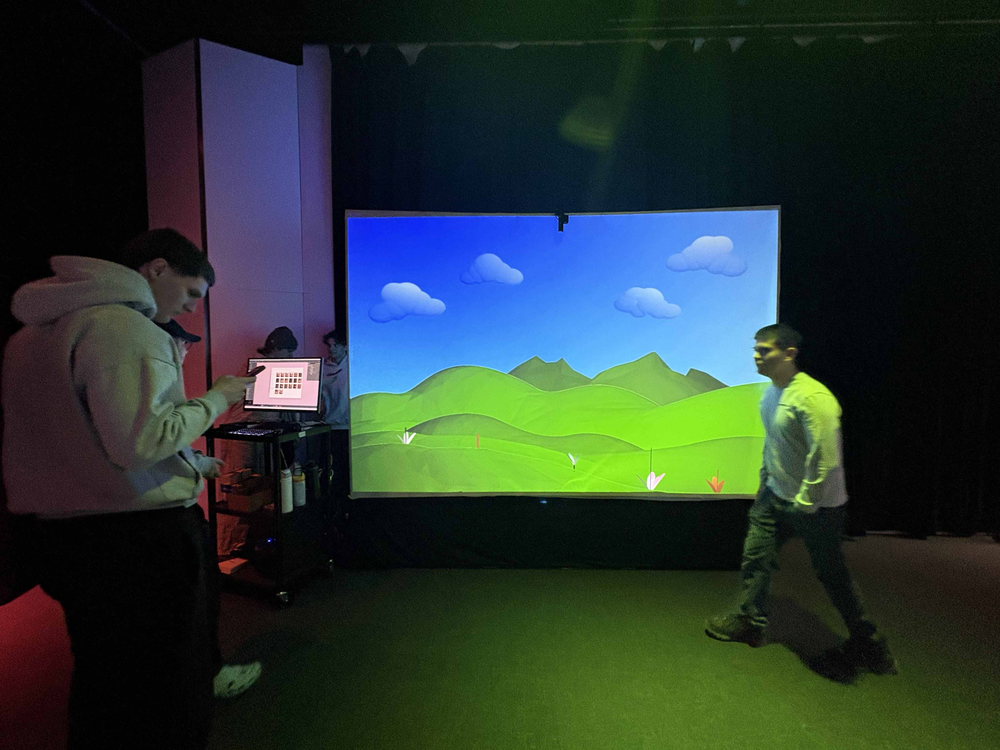
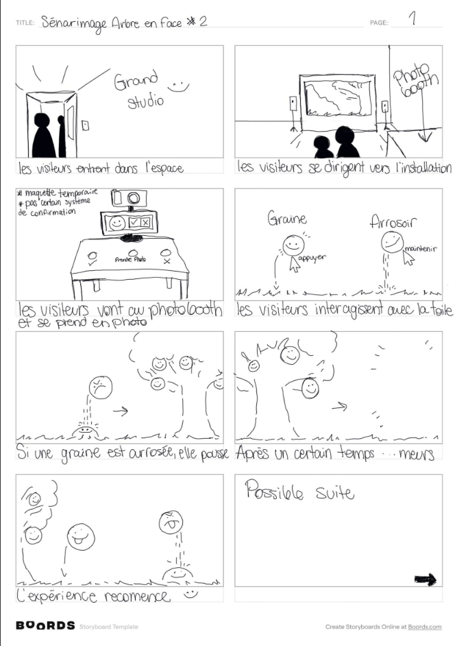

|:pencil2: Information recherchée  | :camera: Appui visuel à intégrer | Détails supplémentaires |
| ---     | ---             | --- |
| No ordre de préférence |2| |
| Titre du projet |O.I.G.N.O.N| |
| Noms des créateurs et créatrices|Ahmed Kaissoumi, Radhouane Kordan, Justin Montpetit, Thearylou Lach, Jad Saloumi| |
| Installation en cours (ou finale)|  | |
| Schéma de l'installation prévue|  |télécharger le dessin à partir de la documentation GitHub de l'équipe, et indiquer la source dans la légende et le nom du fichier|
| Ce que vous ressentez en expérimentant chacune des installations, avec justification (avant/après l'expérimentation)|Lors de la première expérimentation, on a eu des difficultés techniques du projet O.I.G.N.O.N, par exemple les boutons qui sont inversés ou sinon des boutons qui ne fonctionnent pas. Cependant, à la deuxième rencontre, les aspects techniques sont bien résolus et ont amélioré mon expérience, ce qui est plaisant mais fascinant.| |

|:pencil2: Information recherchée  | :camera: Appui visuel à intégrer | Détails supplémentaires |
| ---     | ---             | --- |
| No ordre de préférence |3| |
| Titre du projet |SYMBIOSE| |
| Noms des créateurs et créatrices| Yannick Chamverland, Benjamin Ferland, Ryand Dufault, Walid Cheour| |
| Installation en cours (ou finale)|| |
| Schéma de l'installation prévue| |télécharger le dessin à partir de la documentation GitHub de l'équipe, et indiquer la source dans la légende et le nom du fichier|
| Ce que vous ressentez en expérimentant chacune des installations, avec justification (avant/après l'expérimentation)|Lors de la première visite, je trouvais que le projet était bien fait pour jouer à quatre personnes et la manière dont on doit opérer les instruments pour jouer était vraiment géniale. Puis, à la deuxième visite, il n’y avait pas tant de différences lorsque je jouais, cependant ils ont amélioré le fait qu’au début on s’asseyait, mais maintenant on est debout, ce qui améliore notre posture quand on joue.| |

|:pencil2: Information recherchée  | :camera: Appui visuel à intégrer | Détails supplémentaires |
| ---     | ---             | --- |
| No ordre de préférence |4| |
| Titre du projet |Océan Rouge| |
| Noms des créateurs et créatrices|Amira Tounekti, Kristy Moussally| |
| Installation en cours (ou finale)| | |
| Schéma de l'installation prévue|  |télécharger le dessin à partir de la documentation GitHub de l'équipe, et indiquer la source dans la légende et le nom du fichier|
| Ce que vous ressentez en expérimentant chacune des installations, avec justification (avant/après l'expérimentation)|À ma première visite, je trouvais le jeu vraiment addictif, comme si je pouvais rester très longtemps, puis à la deuxième, ils ont amélioré l’aspect esthétique, ce qui a renforcé l’intrigue et même capturé l’intérêt des gens dans mon cas.| |

|:pencil2: Information recherchée  | :camera: Appui visuel à intégrer | Détails supplémentaires |
| ---     | ---             | --- |
| No ordre de préférence |5| |
| Titre du projet |Quand les yeux se croisent| |
| Noms des créateurs et créatrices|Edelwyn Ledru, Félix Lavoie, Jade Hébert, Manel Yaya, Patricia Nassif| |
| Installation en cours (ou finale)|| |
| Schéma de l'installation prévue| s|télécharger le dessin à partir de la documentation GitHub de l'équipe, et indiquer la source dans la légende et le nom du fichier|
| Ce que vous ressentez en expérimentant chacune des installations, avec justification (avant/après l'expérimentation)|Esthétiquement, je trouve ce projet le meilleur : dès que je suis rentré, il a attiré mon intérêt en premier et lorsque j’ai essayé, je trouve fascinant le fait qu’il prenne la vidéo de notre œil et la mette dans sa base de données. Pour la deuxième visite, je ne trouve pas tant de modifications, c’était comme s’il n’avait pas changé.| |

|:pencil2: Information recherchée  | :camera: Appui visuel à intégrer | Détails supplémentaires |
| ---     | ---             | --- |
| No ordre de préférence |6| |
| Titre du projet |Arbre en Face| |
| Noms des créateurs et créatrices|Alexandre Gendron, Mikael Arseneau, Mathieu Willett, Matis Ghariani, Rafael Angon Dube| |
| Installation en cours (ou finale)|| |
| Schéma de l'installation prévue| |télécharger le dessin à partir de la documentation GitHub de l'équipe, et indiquer la source dans la légende et le nom du fichier|
| Ce que vous ressentez en expérimentant chacune des installations, avec justification (avant/après l'expérimentation)|J’aimais bien que le projet était immersif et qu’on pouvait interagir avec, et ce qui me surprenait le plus était le fait qu’il prenait des photos de notre visage dès qu’on rentrait. Pour la deuxième visite, je trouvais qu’ils ont organisé plus d’espace pour permettre à plusieurs gens d’y manipuler, ce qui améliore la circulation.| |
