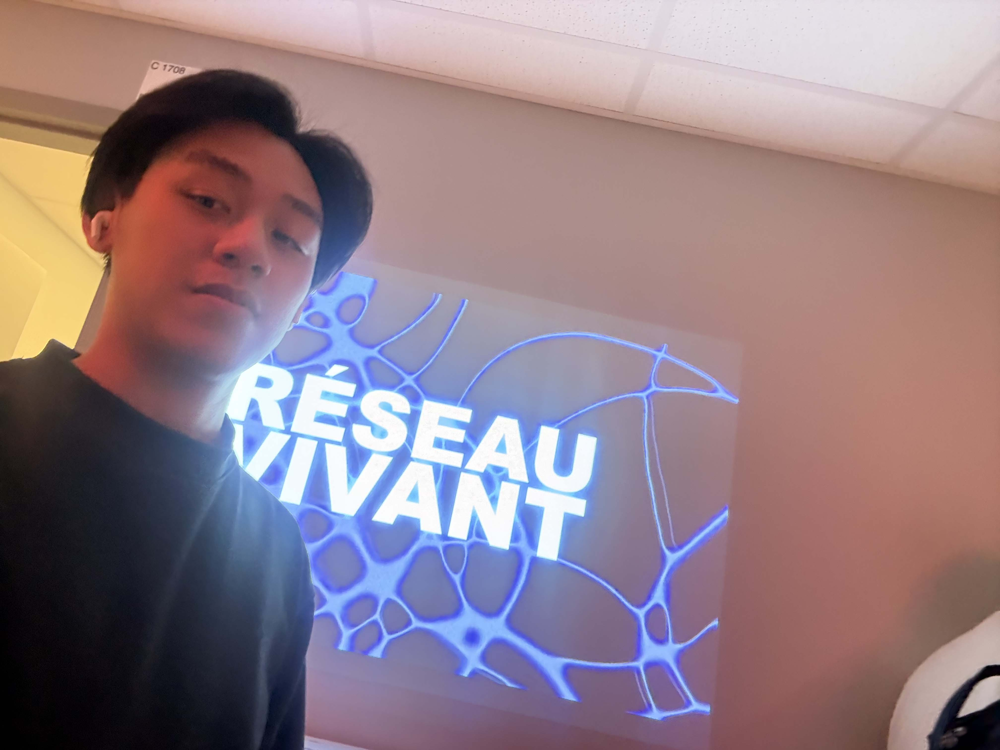
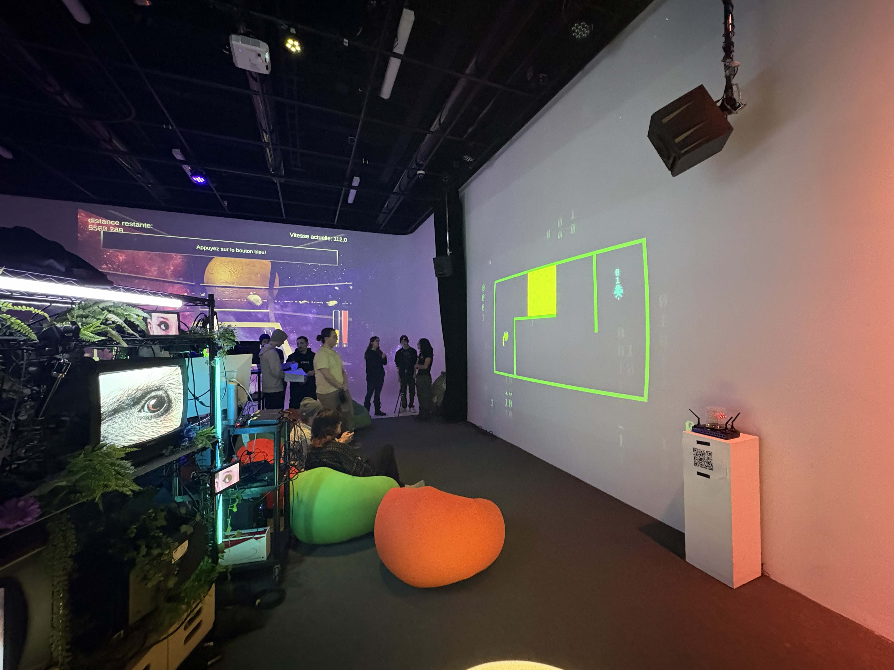
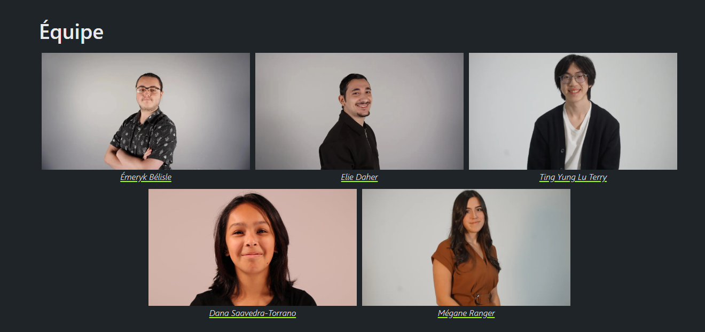
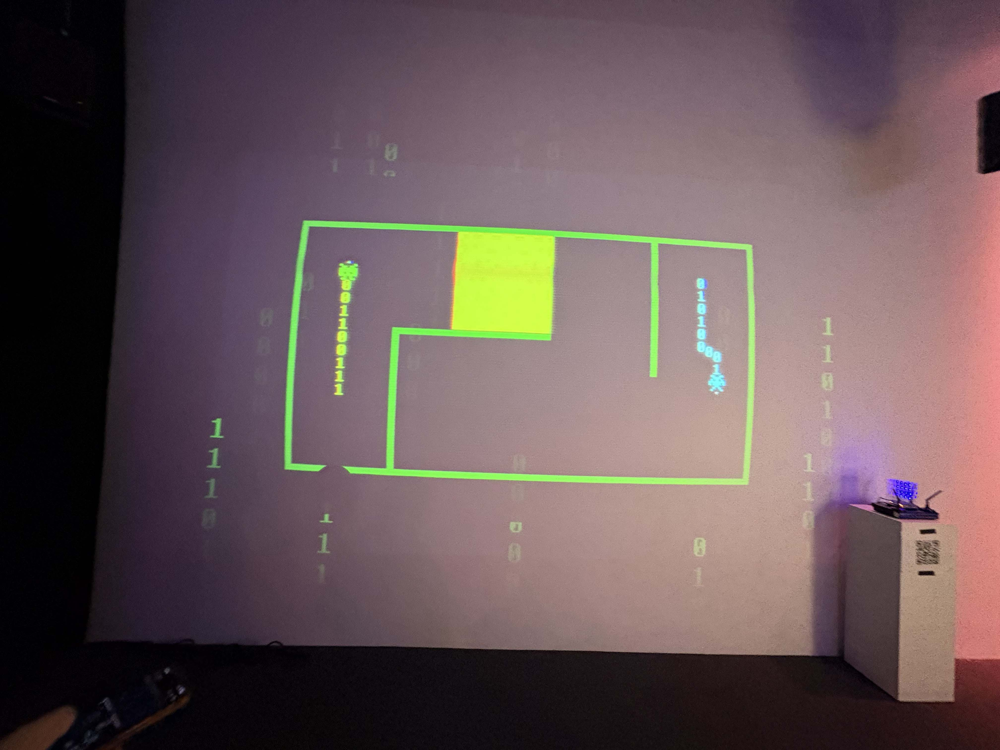
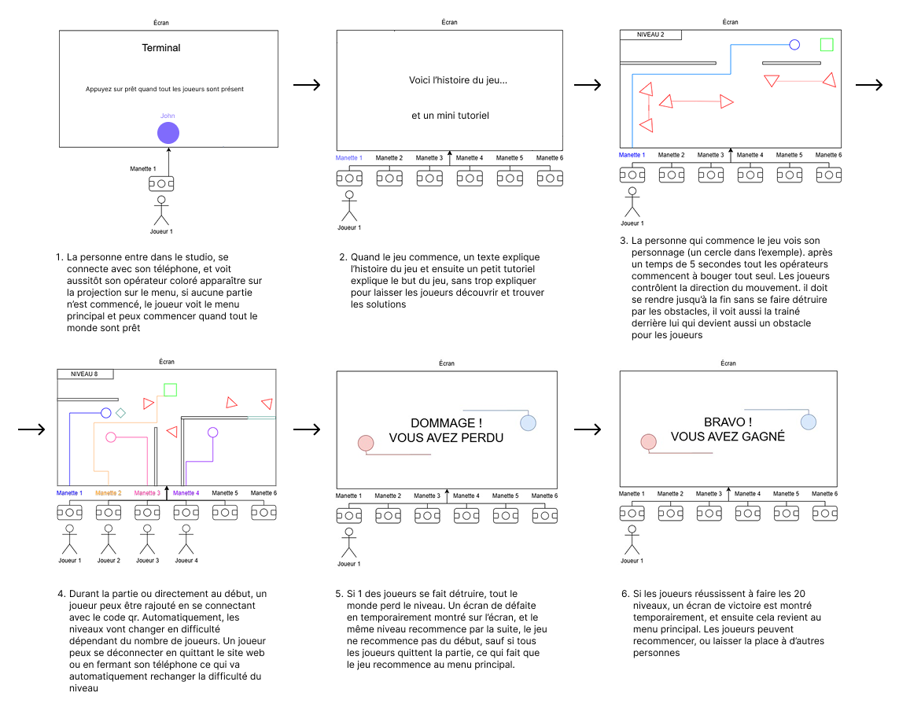
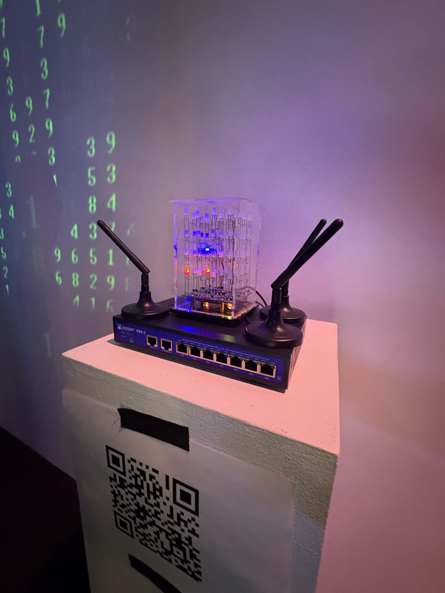
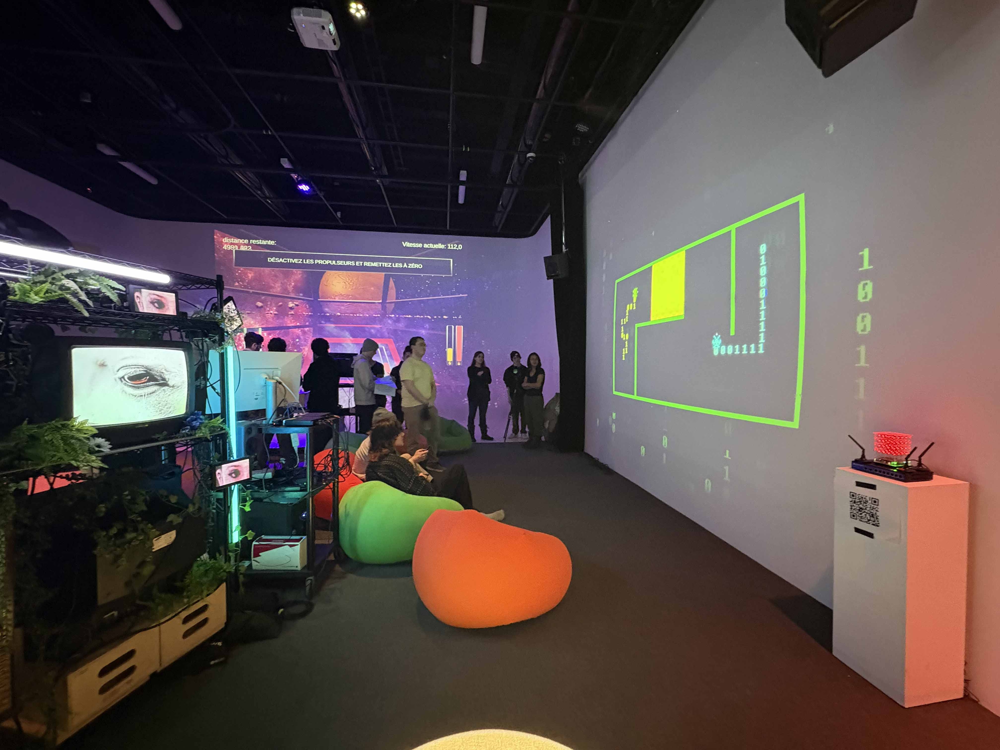
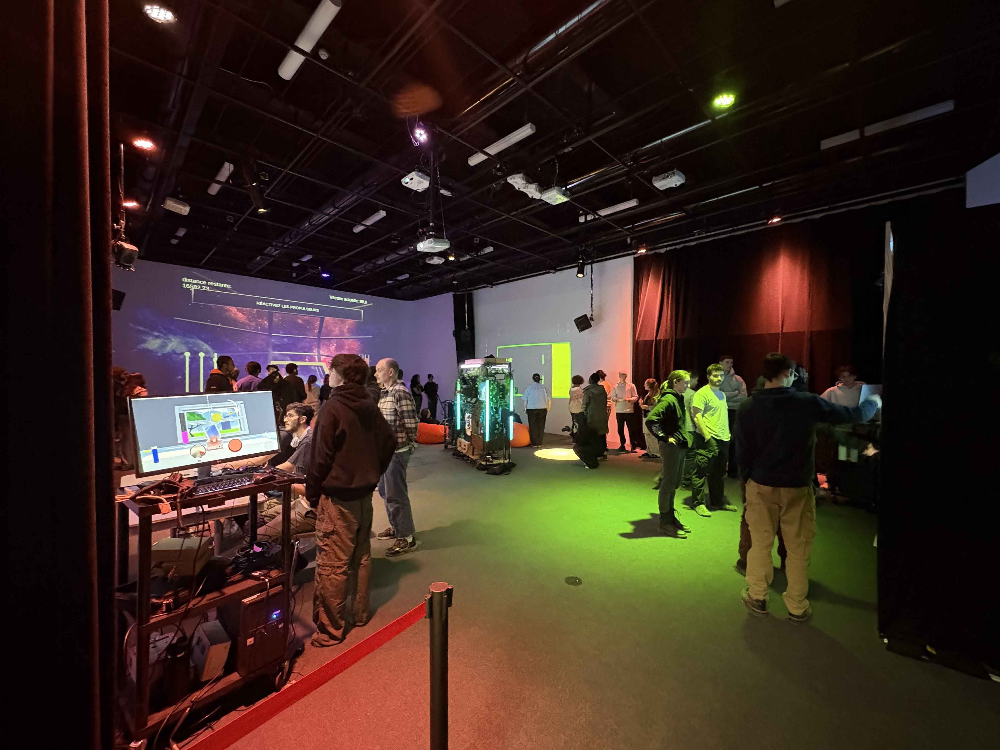

## 1. Informations 

**Nom de l’exposition ou de l’événement :**  
RÉSEAU VIVANT

**Affiche de l’exposition :**  

> Affichage par Nguyen Phu Thanh

**Lieu de mise en exposition :**  
Collège Montmorency, Laval (Québec) 
475 Boulevard de l'avenir, Laval Quebec H7N 5H9 

> Adresse par Nguyen Phu Thanh

**Type d’exposition :**  
Exposition intérieure et temporaire

**Date de visite :**  
02/24/2026 et 03/16/2026

---

## 2. Informations sur l’œuvre ou le dispositif

**Titre de l’œuvre ou du dispositif :**  
TERMINAL

**Vue d’ensemble de l’oeuvre :**  

> L'ensemble de l'oeuvre par Nguyen Phu Thanh

**Nom de l’artiste ou de la firme :**  
Émeryk Bélisle, Elie Daher,Ting Yung Lu Terry, Dana Saavedra-Torrano, Mégane Ranger 

> Artiste ou de la firme par l'équipe de Terminal

**Année de réalisation :**  
Non spécifiée

---

## 3. Description

TERMINAL est une installation interactive pouvant accueillir jusqu’à six joueurs. Chacun contrôle un opérateur à l’aide de la manette sur son téléphone afin de restaurer un ancien réseau informatique piraté. Lorsqu’un joueur se déplace, une ligne suit sa trajectoire et devient un obstacle pour les autres opérateurs. L’objectif est que tous atteignent la fin des niveaux sans être éliminés par les pièges laissés par le pirate ou par les traces des coéquipiers. En cas d’élimination, toute l’équipe doit recommencer le niveau depuis le début. Au fil de la progression, les niveaux deviennent de plus en plus complexes, avec l’apparition de boutons ouvrant des passages, d’obstacles mobiles et de nombreux défis qui exigent communication et coordination.

---

## 4. Type d’installation

**Type :**

- Interactif

Les visiteurs interagissent en jouant au jeu avec leur cellulaire, qui agit comme une manette pour contrôler les joueurs.

---

## 5. Fonction du dispositif multimédia

Fonctions principales :

- Jeu collaboratif jusqu’à 6 joueurs : connexion via le téléphone, transformé en manette pour contrôler les opérateurs.
- Mécanique de traçage : les traces laissées par les opérateurs deviennent des obstacles permanents pour les autres.
- Progression dynamique : les niveaux gagnent progressivement en difficulté.
- Éléments interactifs : boutons d’activation pour déverrouiller des portes, trois power-ups (arrêt du temps, effacement de la trace, traversée des murs) et un ennemi « virus » qui tire sur les opérateurs lorsqu’il les   repère.
- Système d’élimination : si un joueur est éliminé, toute l’équipe doit recommencer le niveau.
- Interface intuitive : manettes colorées sur téléphone affichant la forme et la couleur de chaque joueur.
- Ambiance immersive : projection grand format couvrant le mur jusqu’à la bordure du sol, accompagnée de lumières réactives au jeu.

---

## 6. Mise en espace

Le dispositif consiste en une projection murale réalisée à l’aide d’un projecteur, accompagnée de poufs gonflables afin d’assurer le confort des visiteurs et des joueurs.

### Croquis simplifié

> Une schema du mise en espace par l'équipe de Terminal
---

## 7. Composantes et techniques

### Parties composantes

- Ordinateur principal sur chariot (1): PC de contrôle exécutant Unity, gère le jeu, les connexions et la projection.
- Projecteur (1): Projection murale grand format pour afficher la zone de jeu commune.
- Tablettes / phones (1-6): Contrôleurs utilisés par les joueurs (connexion Wi-Fi).
- Routeur Wi-Fi (1): Permet la connexion des téléphones si le jeu est accessible via navigateur mobile.
- Haut-parleurs amplifiés (2): Diffusion stéréo des sons du jeu pour renforcer l’immersion collective.
- Sender / Receiver (1 chaque): Permet de connecter le cable video de l'ordinateur vers le projecteur.
- Cables Ethernet (3 à 4): Connectez les matériaux à l'internet
- Câbles vidéo (1): HDMI ou DisplayPort reliant le PC au projecteur.
- Câbles audio (2): XLR pour relier la sortie audio aux haut-parleurs.
- Câbles d’alimentation: Selon les haut-parleurs et le projecteur.
- Multiprise / rallonge électrique – Pour alimenter l’ensemble du système.
- Lumière plafond American D
- Lumière Baton (2-4): Mettre de la lumière d'ambiance qui change avec une donné en boucle
- Boite de lumière (1): Permet de brancher les lumière en daisy chain et les reliers à l'ordinateur
- Ralonges pour lumières (2-4) Brancher les lumières mêmes si elles sont loins l'une et l'autre
- Power supply pour boite à lumière: Donner le power à la boite à lumières
- Boules de connections de lumières (2): Faire tenir les lumières droites
- Carte graphique extérieur (1): Pour projeter les données vers les couleurs de lumières 

> Matériaux

### Éléments nécessaires à la mise en exposition

- Pouf gonflable(6)
- Podium code Qr
- Fairy lightsa
- Mur 

> Batiments
---

## 8. Expérience vécue

En entrant dans le grand studio, les visiteurs lisent le cartel présentant le projet et ses instructions. Les joueurs doivent ensuite se connecter au routeur et balayer le code QR pour accéder au jeu. Une fois que tout le monde a appuyé sur « prêt », l’écran affiche une courte introduction qui explique les bases en quelques secondes. La partie commence au niveau 1 et les joueurs réalisent rapidement qu’ils doivent communiquer : lorsqu’ils se déplacent, une ligne permanente apparaît derrière leur opérateur et devient un obstacle pour les autres. Si l’un d’eux est éliminé, toute l’équipe recommence le niveau. Les participants apprennent ainsi par essais et erreurs. À mesure qu’ils progressent, les niveaux intègrent de nouvelles mécaniques, comme des portes, des obstacles mobiles et une difficulté croissante.

> Mise en espace par Nguyen Phu Thanh
---

## 9. Réflexion personnelle

### Ce qui m’a plu

J’aimais le fait que le jeu a plusieurs niveaux pour permettre de la variété, ainsi que les poufs gonflables pour le confort lorsqu’on joue.

### Ce que je ferais autrement

Ce qui pourrait être fait, c’est d’améliorer la connexion entre la manette et l’opération pour permettre un meilleur contrôle sur les joueurs dans le jeu.

---

## 10. Références
 
https://pythons-5.github.io/Terminal/#/

Photos prises par Nguyen Phu Thanh
