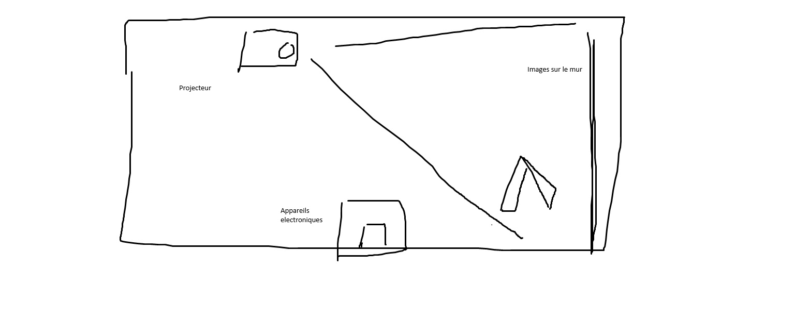

# **Présentation – Galerie de l'Universite de Montréal**  
Nom : Nguyen  
Prénom : Phu Thanh  
Titre : Premier galerie 
Cours : Technique Multimedia  
Session 02/ Cours 3  

---

## Diapositive 2 — Nom de l'exposition
L'exposition du galerie de l'Université de Montreal est appelé "Devenirs partage. Pratiques de l'IA". Le but de l'exposition est de mettre en jeux l'AI en faisant de l'art avec.

> nom de l'exposition et l'entrée du exposition 

## Diapositive 3 — Lieu de mise en exposition
Pour retrouver ce exposition, il est situé à Montreal où le lieu d'hébergement est à l'Université de Montreal,Centre d'exposition de l'Université de Montréal, Chemin de la Côte-Sainte-Catherine, Montreal QC H3T 1B4.

> Location du exposition prit par Berbiche Wilhene

## Diapositive 4 — Date de votre visite
J'ai participé à la galerie de l'Université à Montreal, le 30 Janvier 2026 pour voir les creation d'arts introduisent par des talentieux artistes qui utilisent de l'intelligence artificiel pour exprimer leurs emotions en forme d'art.

## Diapositive 5 — Titre de l'oeuvre
Dans l'exposition, il y a quatre oeuvres qui sont exposés, cependant lequel qui captive mos intérets le plus est nommé en anglais "Common Ground" ou en francais "Terre commune".

> information de l'oeuvre

## Diapositive 6 — Nom de l'artiste
L'artiste qui a realisé "Common Ground" ou "Terre commune", s'appelle Marion Schneider. 

## Diapositive 7 — Année de realisation
Marion Schneider a dévéloppé "Common Ground" ou "Terre commune" en 2025, le moment où l'intelligence artificiel est devenu un enjeu mondiale qui amène du prosperité et en même de la désespoir. 

## Diapositive 8 — Description de l'oeuvre
L'oeuvre ce que Marion Schneider voulez stimuler, est une creation d'une database selon les frequencse émises par notre cerveau. Cela permet à l'AI de créer des images de nature avec nos fréquences.

> Une description de l'oeuvre

## Diapositive 9 — Type d'installation
Donc pour ce oeuvre, Marion Schneider a eu le conception de faire une oeuvre plutot interactif pour les spectateurs. Il voulait que les audiences avec leurs fréquences cervicales de transférer des données à une machine pour permet de lire et de projecter une image selon les données.

> Une person qui intéragit avec l'appareil

## Diapositive 10 — Mise en espace
Le batiment qui accomode les oeuvres étaient une chambre en rectangle complement blanc pour bien afficher quelques arts avec l'aide du projecteur.

> Une schema du mise en espace

## Diapositive 11 — Composantes et techniques
Pour realiser ce art, l'artist à besoin des composantes technologiques comme un ordinateur, un casque, un projecteur, des cablese et un écran dénudé. Ceci permet à l'art de se produisent pour qu'on observe la capacité de l'intelligence artificiel.
Ses instruments servent à transformer à capturer nos ondes, transmets les informations, analyser et de créer l'image.

> Matériaux nécessairent à reproduire l'oeuvre

## Diapositive 12 — Éléments nécessaires a la mise en exposition
Pour bien accomoder nos audiences, l'artist doit utiliser des matériaux telles qu'un mur pour permet d'avoir une image pour projecter sur et aussi un banc avec des mirroirs sur une structure aluminium pour que les audiences s'assoient.

> l'environnement de l'oeuvre

## Diapositive 13 — Expérience vécue
L'expo "Terre commune" est directement en face à votre droite lorsque vous rentrer.

> Placement de l'oeuvre

## Diapositive 14 — Ce qui vous a plu, vous a donné des idées
Ce que j'ai bien aimé du exposition, c'est la manière d'où on a intéragit avec l'art qui donne à l'AI, notre fréquence pour permet de créer des images.

## Diapositive 15 — Aspect que vous ne souhaiteriez pas retenir pour vos propes créations ou que vous feriez autrement
Pour améliorer la composition, selon moi, l'appareil qui lit notre fréquence doit etre plus precise pour donner des résultats precisent. Cela permet aux audiences de comprendre et de vraiment voir l'ingénuité de l'intelligence artificiel.

## Diapositive 16 — Référemces
https://schneidermarion.net/  
photographeur : Nguyen Phu thanh  
photographeur du premier image(lieu de mise en exposition) : Berbiche Wilhene

